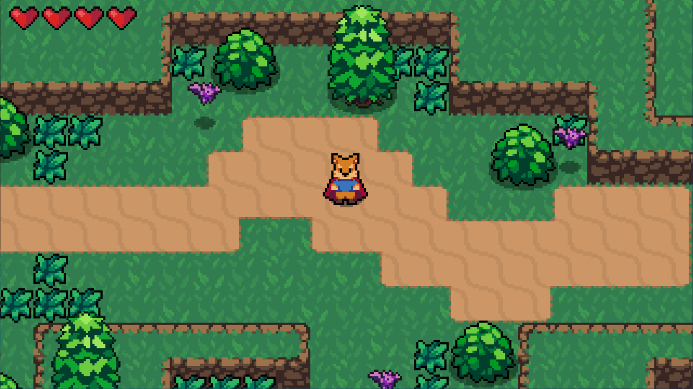

# Godot-arpg

[项目素材](https://github.com/uheartbeast/youtube-tutorials/blob/master/Action%20RPG/Action%20RPG%20Resources.zip)，[项目教程](https://www.youtube.com/watch?v=mAbG8Oi-SvQ&t=1s)。

原项目由油管UP [HeartBeast](https://www.youtube.com/channel/UCrHQNOyU1q6BFEfkNq2CYMA?pbjreload=101) 所有，该项目文件为自学自用，这是相关[笔记](https://yantree.github.io/posts/develop/2020-05-05-godot3-2-1-action-rpg/)。

> 制作该项目所使用的是 Godot_v3.2.1

